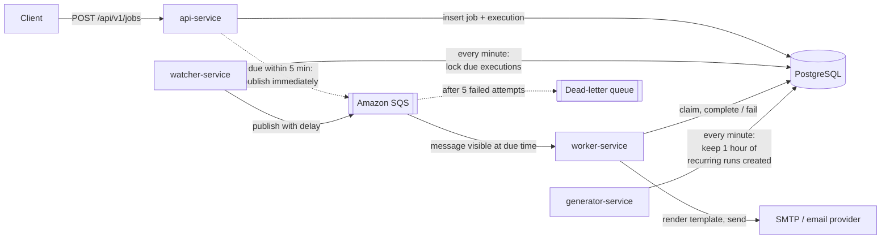

# Distributed Job Scheduler

A job scheduler that accepts "run this at time T" and "run this on a cron
schedule" requests over HTTP and executes them on time, reliably, across
multiple processes. Jobs are stored in PostgreSQL, handed off through Amazon
SQS, and executed by horizontally scalable workers. The first job type sends
templated HTML emails.

Built with Java 21, Spring Boot 4, PostgreSQL 18 and Amazon SQS.

## Highlights

- **At-least-once delivery with duplicate protection.** Duplicate messages
  and crashed processes are expected, not exceptional: an atomic claim in the
  database decides which worker runs an execution, and every status update is
  guarded so a finished job is never overwritten. A job can only run twice if
  a worker dies in the instant between sending and recording completion.
- **Horizontally scalable.** Run any number of watchers and workers; they
  coordinate through the database (`FOR UPDATE SKIP LOCKED`) and SQS
  visibility timeouts, with no distributed lock service.
- **On time.** Jobs are published to SQS ahead of time with a per-message
  delay, so they become visible at their scheduled second. In a load test,
  2,000 jobs due at the same instant all finished within 8 seconds using two
  workers.
- **Failure handling.** Transient failures (mail server down, database
  unreachable) are retried; permanent ones (invalid data) fail immediately;
  messages that keep failing go to a dead-letter queue.
- **Validated, versioned templates.** Each task type has a versioned Mustache
  template and a JSON Schema for its parameters. Requests are validated
  against the schema, and each job is pinned to the template version it was
  accepted with.

## Architecture



1. **API** validates the request, stores the job and its execution in one
   transaction, and publishes it right away if it's due within the next five
   minutes.
2. **Watcher** runs every minute, picks up executions due within the next five
   minutes in batches, and publishes them to SQS with a delay so each message
   appears exactly when the job is due.
3. **Generator** (recurring jobs) keeps the next hour of runs created for
   every active cron schedule, and marks a recurring job completed once its
   schedule has ended.
4. **Worker** receives the message, atomically claims the execution, renders
   the email, sends it, marks the execution completed, and only then deletes
   the message. If anything fails before that, SQS redelivers.

Each execution moves through `PENDING → QUEUED → PROCESSING → COMPLETED` (or
`FAILED`).

## Project structure

| Module | Purpose |
|---|---|
| [`api-service`](api-service) | REST API for creating and reading jobs |
| [`watcher-service`](watcher-service) | Publishes due executions to SQS |
| [`worker-service`](worker-service) | Consumes from SQS and executes jobs (sends email) |
| [`generator-service`](generator-service) | Creates upcoming runs of recurring (cron) jobs |
| [`common`](common) | Shared library: statuses, the SQS message contract, the publisher |
| [`db-migrations`](db-migrations) | Flyway migrations; runs once before the services and exits |
| [`docs`](docs) | Design documents, test plan and results, backlog |
| [`docker`](docker) | Local PostgreSQL and Mailpit (a local mail inbox) |
| [`dev`](dev) | SQL scripts for local testing (seed data, load tests, result checks) |

## Tech stack

Java 21 · Spring Boot 4.1 · PostgreSQL 18 (UUIDv7 keys) · Flyway ·
`JdbcClient` with hand-written SQL · AWS SDK v2 and Spring Cloud AWS (SQS) ·
JMustache · JSON Schema validation (networknt) · Maven (multi-module) · Docker
Compose

## Running locally

**Prerequisites:** JDK 21+, Docker, and an AWS account with an SQS queue.

1. **Start PostgreSQL and Mailpit.**
   ```bash
   docker compose -f docker/postgres/docker-compose.yml up -d
   docker compose -f docker/mailpit/docker-compose.yml up -d
   ```
   Mailpit catches all outgoing email; its inbox is at http://localhost:8025.

2. **Create the SQS queues** in your AWS account: a Standard queue with a
   60-second visibility timeout, and a dead-letter queue attached to it with
   `maxReceiveCount` 5. Put the queue URL and region in each service's
   `application.properties` (`app.sqs.*`), and make AWS credentials available
   through the default provider chain (e.g. an `AWS_PROFILE`).

3. **Build.**
   ```bash
   ./mvnw package -DskipTests
   ```

4. **Create the schema, then start the services** (each in its own terminal).
   ```bash
   java -jar db-migrations/target/db-migrations-0.0.1-SNAPSHOT.jar
   java -jar api-service/target/api-service-0.0.1-SNAPSHOT.jar
   java -jar watcher-service/target/watcher-service-0.0.1-SNAPSHOT.jar
   java -jar worker-service/target/worker-service-0.0.1-SNAPSHOT.jar
   java -jar generator-service/target/generator-service-0.0.1-SNAPSHOT.jar
   ```
   Start more watchers or workers the same way to scale out.

5. **Add a test user** with [`dev/sql/01_seed_test_user.sql`](dev/sql/01_seed_test_user.sql).

## API

**Schedule a job**

```bash
curl -X POST http://localhost:8080/api/v1/jobs \
  -H 'Content-Type: application/json' \
  -d '{
        "userId": 1,
        "taskType": "welcome_email",
        "params": { "to": "someone@example.com", "first_name": "Sam" },
        "scheduledAt": "2026-10-01T09:30:00+05:30"
      }'
```

Returns `201 Created` with a `Location` header and the job, including its
current `executionStatus`.

**Schedule a recurring job**: send a standard 5-field cron expression and a
time zone instead of `scheduledAt` (at most once a minute):

```bash
curl -X POST http://localhost:8080/api/v1/jobs \
  -H 'Content-Type: application/json' \
  -d '{
        "userId": 1,
        "taskType": "welcome_email",
        "params": { "to": "someone@example.com", "first_name": "Sam" },
        "cronExpression": "30 9 * * MON-FRI",
        "timezone": "Asia/Kolkata",
        "maxOccurrences": 20
      }'
```

`startsAt`, `endsAt` and `maxOccurrences` are optional. Runs happen at the
local time of the given zone, including across daylight-saving changes.

**Check a job**: its status and next run (and, for recurring jobs, the
schedule):

```bash
curl http://localhost:8080/api/v1/jobs/{id}
```

**List a job's runs**: newest first, paged (`limit` up to 100; pass the
returned `nextBefore` as `before` for the next page):

```bash
curl "http://localhost:8080/api/v1/jobs/{id}/executions?limit=20"
```

Invalid requests return `400` with an
[RFC 9457](https://www.rfc-editor.org/rfc/rfc9457) problem response listing
each invalid field, including fields that fail the task type's JSON Schema.

## Testing

The system has been tested end to end against a written
[test plan](docs/test-plan.md): the happy path, API validation, a 2,000-job
load test with multiple watchers and workers, duplicate messages, the mail
server going down, bad data, crashed and killed processes, and a database
outage. Every scenario recovered on its own without restarts or data loss.

A [stress and chaos test](docs/stress-test-report.md) ran 125,000 jobs in 10
minutes (including 10,000 due in the same second) while workers were killed
with `kill -9` every minute: all completed, with no failures and no duplicate
emails.

## Documentation

- [Schema design](docs/schema.md): tables, and the reasoning behind each
  decision
- [Infrastructure](docs/infrastructure.md): SQS, watcher, worker and failure
  handling in detail
- [Test plan and results](docs/test-plan.md)
- [Stress and chaos test report](docs/stress-test-report.md): 125,000 jobs,
  workers killed every minute
- [Performance report](docs/performance-report.md): that test's numbers per
  worker, per step, per minute and per burst
- [Backlog](docs/backlog.md): what's planned next

## Roadmap

- Real email delivery through Amazon SES
- Authentication
- Automated integration tests with Testcontainers
- Container images for each service
